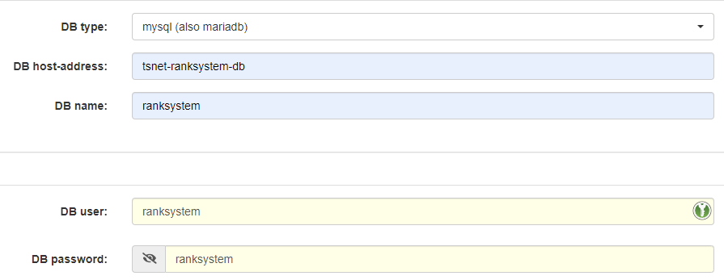

[](https://github.com/JohannesBauer97/tsn-ranksystem-webserver/actions/workflows/docker-publish.yml) 
[](https://hub.docker.com/r/serverlein/tsn-ranksystem-webserver)
[](https://github.com/JohannesBauer97/tsn-ranksystem-webserver/blob/main/LICENSE)
# Docker webserver to host TSN-Ranksystem

This is a prepared php-apache image with the [required settings](https://ts-ranksystem.com/#linux) to run TSN-Ranksystem.

At 12PM on every 15th of the month, an up-to-date image is built and pushed to ensure security updates.

## Quick Links
* TSN-Ranksystem: [GitHub](https://github.com/Newcomer1989/TSN-Ranksystem) / [Website](https://ts-ranksystem.com/)
* Docker Hub: https://hub.docker.com/r/serverlein/tsn-ranksystem-webserver
* Repository: https://github.com/JohannesBauer97/tsn-ranksystem-webserver

## Dependencies / Configuration of this webserver

- PHP 8
- enabled `exec` command
- unlimited php script execution time (`max_execution_time = 0`)
- Enabled Extensions
  - PDO
  - PDO MySQL
  - cURL
  - Zip
  - OpenSSL
  - SSH2
  - mbstring

## Usage

1. Start with `docker-compose up`
2. Copy the TSN-Ranksystem application into the `www` folder
3. Follow instructions on http://localhost:8080/install.php



**docker-compose.yml**

```
version: '3'

services:
    ranksystem:
      image: serverlein/tsn-ranksystem-webserver:latest
      restart: always
      ports:
        - 8080:80
      networks:
        tsnet:
          aliases:
            - tsnet-ranksystem
      volumes:
        - ./www/:/var/www/html/

    ranksystem-db:
      image: mariadb:10.6
      restart: always
      environment:
        MARIADB_USER: ranksystem
        MARIADB_PASSWORD: ranksystem
        MARIADB_ROOT_PASSWORD: root
        MARIADB_DATABASE: ranksystem
      networks:
        tsnet:
          aliases:
            - tsnet-ranksystem-db
      volumes:
        - ./ranksystem-db/:/var/lib/mysql

networks:
    tsnet:
      driver: bridge

```
